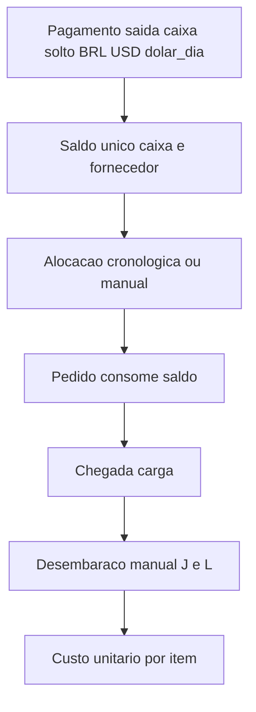

# Plano: Saldo global + alocação em pedidos (sem atrelar pagamento)

## Regra confirmada

- **Pagamento** = só saída de caixa; **não escolhe pedido**. Informa BRL, USD e dólar do dia na hora.
- **Saldo** = único: caixa em R$ + compromisso/fornecedor em USD (pool de pagamentos ainda não consumidos / já consumidos).
- **Pedido nunca “é dono” do pagamento**; o pedido **consome** o saldo via **alocação**.
- Pode pagar **antes** de existir pedido; vários pedidos bebem do mesmo saldo.
- Mercadoria **não chega** antes de estar paga (regra de negócio: só libera desembaraço/custo quando invoice do pedido estiver coberto pela alocação).
- **Sem média de dólar**: cada pagamento guarda seu câmbio; o custo em R$ do pedido usa o dólar **de cada fatia alocada**.
- **Impostos / frete / desembaraço** entram na etapa de desembaraço (após quitar a dívida do fornecedor no pedido).
- Rateio do custo da carga por item conforme **% do amount USD do item na carga**.
- Extrato do saldo (+pagamento / −alocação). Lista “falta” **por pedido**. Um usuário.

## Modelo de dados

Substituir o vínculo obrigatório `pagamentos.pedido_id` por alocação:

- `pagamentos` — `data`, `descricao`, `valor_brl`, `valor_usd`, `dolar_dia`, `tipo` (`fornecedor` | `desembaraco` | `frete` | `outro`). Sem `pedido_id` na UI (coluna pode ficar NULL).
- `alocacoes` — `pagamento_id`, `pedido_id`, `valor_usd`, `valor_brl` (ou `valor_brl = valor_usd * dolar_dia` do pagamento), `created_at`.
- Manter `pedidos`, `itens_pedido`, `desembaracos`, `itens_desembaraco` (amarelos J/L).
- Remover dependência de `mediaDolar` no custo unitário; passar a usar **somatório das alocações** do pedido.

## Motor de saldo e FIFO

Em serviço dedicado (ex.: [src/services/saldoService.js](c:\Users\trind\Desktop\Paulo\src\services\saldoService.js)):

- Saldo disponível USD = `SUM(pagamentos.valor_usd) - SUM(alocacoes.valor_usd)` (e equivalente BRL).
- Extrato: linhas de crédito (pagamento) e débito (alocação).
- **Alocar FIFO**: percorre pagamentos por data/id e pedidos abertos por data/id; vai abatendo até cobrir `invoice_usd` do pedido (ou até acabar saldo).
- Alocação manual: usuário escolhe pedido e quanto USD consumir de um pagamento (com validação de saldo restante daquele pagamento).
- Pedido **quitado com fornecedor** quando `SUM(alocacoes.valor_usd) >= invoice_usd`.

## Custo por item (após desembaraço)

Quando o pedido estiver coberto e o desembaraço for salvo:

1. `custo_produto_brl` do pedido = soma `alocacao.valor_usd * pagamento.dolar_dia` (dólar de cada pagamento).
2. Somar custos de desembaraço (L rateado + impostos da planilha amarela, regra atual).
3. Rateio por item: `% = amount_usd_item / invoice_usd`.
4. `custo_unitario = (parcela_brl_do_item) / quantidade`.

Atualizar [src/services/desembaracoCalc.js](c:\Users\trind\Desktop\Paulo\src\services\desembaracoCalc.js) para receber alocações (não média).

## UI

- **Pagamentos**: remover select/filtro de pedido; campos BRL, USD, dólar do dia; cards de saldo global; link para extrato.
- **Saldo / Extrato**: nova rota `/saldo` com movimentações e botão “Alocar FIFO” / alocação manual.
- **Pedido**: invoice, alocado USD, falta USD (invoice − alocado), status “aguardando saldo” vs “quitado fornecedor”; custo por item após desembaraço; sem “média dólar”.
- **Desembaraço**: manter tela amarela; só calcular custo unitário se pedido estiver coberto; usar dólar das alocações.

## Migração a partir do código atual

- Tornar `pedido_id` opcional/NULL nos pagamentos existentes.
- Onde hoje usa `mediaDolar(pedidoId)`, trocar por soma de alocações.
- Remover painel “média do pedido” / “pago atrelado” e substituir por saldo + alocado/falta.

## Critérios de aceite

- Criar pagamento sem escolher pedido; saldo global sobe.
- Criar 2+ pedidos; alocar FIFO; cada um mostra falta até cobrir invoice.
- Pedido coberto → desembaraço → custo unitário por item com câmbios distintos por pagamento.
- Extrato mostra +pagamento e −alocação.
- Não é possível “fechar custo” de pedido sem cobertura de alocação.
